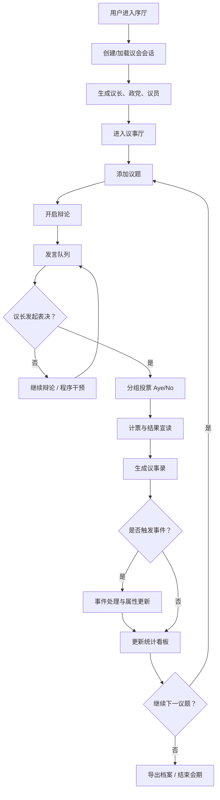

# 议会模拟器产品需求文档

## 1. 产品概述

议会模拟器是一款沉浸式的英式议会推演 Web 应用，允许用户创建虚拟议会、管理政党与议员、主持辩论、发起表决并生成《汉萨德议事录》风格的历史档案。产品面向政治学爱好者、历史推演玩家、教育场景及桌面角色扮演（RPG）主持人，提供兼具策略深度与视觉仪式感的数字议事厅体验。

- 通过 procedurally-driven 的议事流程，帮助用户理解议会制民主的运行机制。
- 目标用户：历史政治爱好者、桌游主持人、课堂教学、策略模拟玩家。
- 产品价值：将复杂的议会程序转化为可交互、可复盘、可分享的精美数字剧场。

## 2. 核心特性

### 2.1 用户角色

| 角色 | 注册/进入方式 | 核心权限 |
|------|---------------|----------|
| 议长（Speaker） | 创建房间即自动成为议长 | 主持议程、分配发言权、宣布表决、裁定程序问题 |
| 议员（MP） | 议长邀请或随机生成 | 提请发言、参与辩论、按政党立场或自由意志投票 |
| 观察员（Visitor） | 旁听模式 | 仅查看议事厅状态与议事录，不可操作 |

### 2.2 功能模块

1. **序厅（Lobby）**：新会话创建、议长登基动画、议会徽章生成、开场仪式。
2. **议事厅（Chamber）**：威斯敏斯特风格座位图、政府/反对党分列、发言台、议长椅、权杖（Mace）陈设。
3. **政党与议员（Members）**：政党创建（名称、颜色、意识形态、党鞭强度）、议员名册（姓名、选区、口才、忠诚度、出勤状态）。
4. **议程与辩论（Agenda & Debate）**：议题起草、修正案、发言权队列、程序干预（Point of Order）、限时发言倒计时。
5. **表决系统（Division）**：分组投票（Aye/No Lobbies）、实时计票、摇摆议员动画、党鞭影响、计票结果宣读。
6. **议事录（Hansard）**：自动生成古典排版议事录，支持导出 Markdown/PDF、时间戳、发言人署名。
7. **事件与新闻（Events & Press）**：随机程序事件（抗议、丑闻、媒体爆料、紧急质询）、公共舆论指数。
8. **统计看板（Analytics）**：政党席位饼图、投票一致性、议长主持时长、法案通过率、历史回溯。
9. **规则手册（Erskine May）**：内置可搜索的议事规则参考，含常用程序术语解释。

### 2.3 页面/视图详情

| 视图名称 | 模块名称 | 功能描述 |
|----------|----------|----------|
| 序厅 | 会话创建 | 设置议会名称、会期年份、下议院/上议院模式、导入预设模板 |
| 序厅 | 议长登基 | 古典入场动画、议长披肩与权杖展示、开幕宣言 |
| 议事厅 | 座位地图 | 半圆形英式长椅布局，按政党着色，点击议员查看详情 |
| 议事厅 | 发言台 | 当前发言人高亮、发言计时器、剩余时间提示 |
| 议事厅 | 氛围层 | 烛火摇曳、窗外阴雨、 Leather/Gold 材质质感 |
| 政党与议员 | 政党卡片 | 编辑党名、意识形态、党鞭强度、领袖肖像 |
| 政党与议员 | 议员名册 | 批量生成/导入、属性编辑、缺席标记、替换补选 |
| 议程与辩论 | 议题管理 | 添加议题、设置议题类型（法案/动议/质询/不信任案） |
| 议程与辩论 | 修正案 | 对母案提出修正案、修正案投票、合并结果 |
| 议程与辩论 | 发言队列 | 先到先得/议长指派、发言时间限制、打断规则 |
| 表决系统 | 分组投票 | 模拟 Aye/No 走廊、议员走动动画、实时计票 |
| 表决系统 | 计票板 | 政党投票分布、关键摇摆票、通过门槛（简单多数/三分之二） |
| 议事录 | 排版视图 | 汉萨德古典双栏排版、花体首字母、页眉徽章 |
| 议事录 | 导出 | Markdown / 打印友好 HTML / JSON 原始数据 |
| 事件与新闻 | 事件卡牌 | 随机或手动触发事件、事件后果影响议员属性 |
| 事件与新闻 | 舆论看板 | 民众支持度、媒体倾向、政府信任指数 |
| 统计看板 | 席位图 | 半圆式席位分布图、政党颜色、空缺席位 |
| 统计看板 | 历史曲线 | 法案通过率、议会出勤、投票一致性时间线 |
| 规则手册 | 程序百科 | 搜索议事规则、查看示例流程图、术语发音 |

## 3. 核心流程

### 3.1 主流程描述

用户进入序厅后创建一次议会会话，系统生成议长、默认政党（保守党、工党、自由民主党等英式模板）与一批随机议员。议长进入议事厅视图，可添加议题并开启辩论。议员通过发言队列依次发言；议长可随时喊停、接受程序问题或发起表决。表决采用分组投票机制，系统根据党鞭强度、议员个人立场及随机事件综合计算投票结果。表决结束后自动生成议事录条目，并更新统计看板。事件系统会随机插入程序波折，用户可手动干预以改变走向。

### 3.2 流程图

## 4. 用户界面设计

### 4.1 设计风格

- **主色调**：下议院皮革绿 `#2D3E2F`、上议院深红 `#6B1C23`、金色 `#C8A13A`、胡桃木 `#4A332A`、羊皮纸 `#F3EFE4`、墨黑 `#1A1714`。
- **按钮风格**：黄铜包边、浅浮雕感、hover 时微光扫过；主按钮使用绿/金配色，危险操作用深红。
- **字体方案**：
  - 标题：Playfair Display（衬线，庄重、英式报业感）
  - 正文：Cormorant Garamond（优雅、可读）
  - 议事录/数据：Cinzel（古典铭文感）+ Source Code Pro（时间戳与元数据）
- **布局风格**：桌面端优先，采用左右侧栏 + 中央议事厅舞台的三栏布局；移动端转为底部标签导航 + 堆叠卡片。
- **图标/插画**：维多利亚时期线描风格（crown、mace、portcullis、laurel wreath），SVG 内嵌，避免 emoji。

### 4.2 动效与氛围

- **入场动画**：序厅大门缓缓推开，徽章从中心缩放浮现，文字逐行 type-in。
- **议事厅氛围**：背景中微弱的烛火闪烁（CSS 动画）、窗外伦敦阴雨（ subtle rain overlay）、权杖微光。
- **交互反馈**：点击议员卡片时轻微仰角 3D tilt；发言时席位边缘亮起金色脉冲；表决时议员头像向 Aye/No 两侧滑动并堆叠。
- **分铃动画**：表决前“Division Bell”钟声 + 屏幕震动 + 顶部通知条下滑。
- **微交互**：hover 按钮出现羽毛笔划过音效提示（视觉波纹）；切换标签时卡片 staggered fade-in。

### 4.3 各视图设计概览

| 视图名称 | 模块名称 | UI 元素 |
|----------|----------|---------|
| 序厅 | 会话创建 | 羊皮纸卷轴表单、蜡封按钮、国徽选择器、年份滚轮 |
| 议事厅 | 中央舞台 | 半圆形座位 SVG、议长高背椅、发言台、权杖台座 |
| 议事厅 | 信息侧栏 | 当前议程、发言队列、计时器、程序按钮 |
| 政党与议员 | 管理面板 | 政党色块、议员头像（DiceBear 生成）、属性滑块 |
| 表决系统 | 分组走廊 | Aye/No 两列、议员头像瀑布流动画、实时数字翻牌 |
| 议事录 | 古籍页面 | 泛黄叶纹背景、双栏排版、首字下沉、页脚页码 |
| 统计看板 | 数据大屏 | 半圆席位图、折线图、卡片 KPI、滚动新闻条 |
| 规则手册 | 百科全书 | 侧边目录、搜索框、引用卡片、流程图 |

### 4.4 响应式策略

- **桌面端（>=1280px）**：完整三栏布局，议事厅半圆座位图全尺寸显示，侧栏常驻。
- **平板端（768px–1279px）**：侧栏可折叠为图标栏，议事厅缩放居中，关键操作固定底部。
- **移动端（<768px）**：底部标签导航（议事厅、议员、议程、记录、更多），卡片垂直堆叠，座位图转为列表视图。
- **触控优化**：议员卡片点击区域不小于 44px，滑动切换视图，表决按钮双确认防止误触。

### 4.5 3D / 视觉场景指导

- 本版本以 2.5D 矢量场景为主，不使用完整 WebGL；使用 CSS 3D transforms 营造议事厅纵深感。
- 焦点元素：中央发言台与议长椅；背景为哥特式尖拱窗剪影。
- 后处理/纹理：全局叠加 subtle grain 与 vignette；羊皮纸视图使用纸张纹理。
- 性能预算：首屏加载 < 2s（3G 模拟），动画优先使用 transform/opacity，避免 layout thrashing。

## 5. 内容需求

- 默认政党模板：保守党、工党、自由民主党、苏格兰民族党、绿党、改革党（英式现代议会）。
- 默认议会议题库：预算案、脱欧条款、教育拨款、医疗改革、环境税、铁路国有化、对外战争授权等。
- 随机事件库：后座议员反叛、媒体泄密、抗议者冲入走廊、王室讲话、不信任案动议、国际危机等。
- 议事规则条目：约 50 条常用规则，每条含标题、解释、示例、相关程序术语。

## 6. 成功指标

- 用户能在 5 分钟内完成一次完整议题的辩论与表决。
- 议事录自动生成的条目 100% 覆盖议题、发言、表决、结果四大要素。
- 界面在 1920×1080、1366×768、390×844 三种分辨率下均无明显布局错位。
- 关键交互（发起表决、添加议员、导出议事录）的首次成功率 >= 95%。
