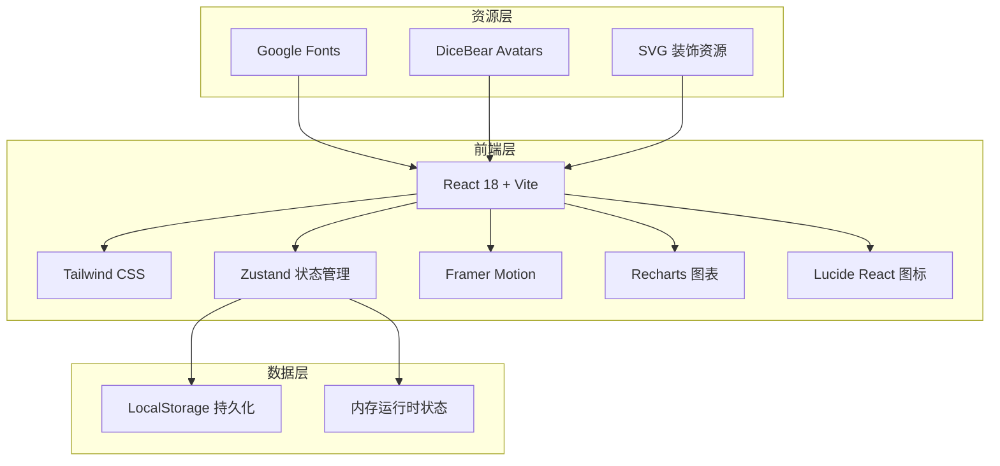
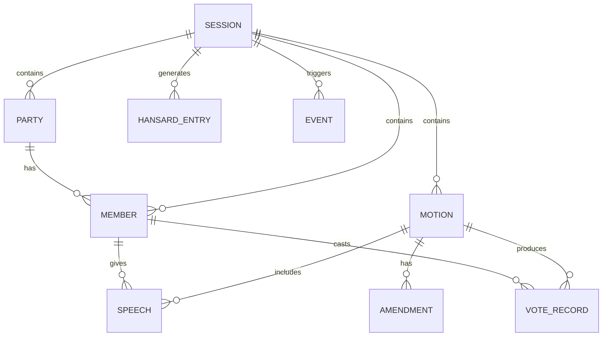

# 议会模拟器技术架构文档

## 1. 架构设计



- 纯前端应用，无后端服务；所有状态通过 Zustand 管理并持久化到 LocalStorage。
- 外部资源仅使用 Google Fonts 字体与 DiceBear 头像服务，无付费 API。

## 2. 技术选型

| 层级 | 技术 | 版本 | 说明 |
|------|------|------|------|
| 前端框架 | React | 18.x | 函数组件 + Hooks |
| 构建工具 | Vite | 5.x | 快速开发与生产构建 |
| 样式方案 | Tailwind CSS | 3.4.x | 原子化 CSS + 自定义设计令牌 |
| 路由 | React Router DOM | 6.x | 视图切换 |
| 状态管理 | Zustand | 4.x | 轻量、可持久化 |
| 动画 | Framer Motion | 11.x | 入场、布局、交互动画 |
| 图表 | Recharts | 2.x | 席位图、历史曲线 |
| 图标 | Lucide React | 0.x | 线描风格图标 |
| 字体 | Google Fonts | - | Playfair Display / Cormorant Garamond / Cinzel |
| 头像 | DiceBear | 9.x | 议员随机肖像 |
| 代码规范 | ESLint + Prettier | - | 统一代码风格 |

## 3. 路由定义

| 路由 | 用途 |
|------|------|
| `/` | 序厅：创建或加载议会会话 |
| `/chamber` | 议事厅主舞台 |
| `/members` | 政党与议员管理 |
| `/agenda` | 议程、辩论与发言队列 |
| `/division` | 分组投票与结果 |
| `/hansard` | 汉萨德议事录 |
| `/events` | 事件与新闻 |
| `/analytics` | 统计看板 |
| `/rules` | 议事规则手册 |

## 4. 数据模型

### 4.1 实体关系图



### 4.2 TypeScript 类型定义

```typescript
interface Session {
  id: string;
  name: string;
  year: number;
  chamber: 'commons' | 'lords';
  speaker: Speaker;
  parties: Party[];
  members: Member[];
  motions: Motion[];
  hansard: HansardEntry[];
  events: EventRecord[];
  publicOpinion: number;
  createdAt: number;
  updatedAt: number;
}

interface Speaker {
  id: string;
  name: string;
  title: string;
  avatar: string;
}

interface Party {
  id: string;
  name: string;
  abbreviation: string;
  color: string;
  ideology: string;
  whipStrength: number; // 0-100
  leaderId: string;
  seats: number;
  isGovernment: boolean;
}

interface Member {
  id: string;
  name: string;
  constituency: string;
  partyId: string;
  avatar: string;
  eloquence: number; // 0-100
  loyalty: number; // 0-100
  attendance: number; // 0-100
  isPresent: boolean;
  isRebel: boolean;
  traits: string[];
}

interface Motion {
  id: string;
  title: string;
  type: 'bill' | 'motion' | 'question' | 'no-confidence';
  description: string;
  proposerId: string;
  status: 'draft' | 'debating' | 'voting' | 'passed' | 'rejected' | 'withdrawn';
  speeches: Speech[];
  amendments: Amendment[];
  vote?: VoteResult;
  createdAt: number;
}

interface Speech {
  id: string;
  memberId: string;
  content: string;
  timestamp: number;
  durationSeconds: number;
  isPointOfOrder: boolean;
}

interface Amendment {
  id: string;
  motionId: string;
  description: string;
  proposerId: string;
  status: 'pending' | 'passed' | 'rejected';
}

interface VoteResult {
  aye: number;
  no: number;
  abstain: number;
  threshold: 'simple-majority' | 'two-thirds';
  passed: boolean;
  records: VoteRecord[];
}

interface VoteRecord {
  memberId: string;
  vote: 'aye' | 'no' | 'abstain';
  reason?: string;
}

interface HansardEntry {
  id: string;
  type: 'speech' | 'vote' | 'event' | 'ruling';
  timestamp: number;
  content: string;
  actorName: string;
  actorTitle: string;
}

interface EventRecord {
  id: string;
  templateId: string;
  title: string;
  description: string;
  impact: EventImpact[];
  resolved: boolean;
  timestamp: number;
}

interface EventImpact {
  targetType: 'party' | 'member' | 'opinion';
  targetId?: string;
  delta: number;
}
```

## 5. 核心逻辑设计

### 5.1 投票计算

1. 每位出席议员根据以下因素决定投票：
   - 政党立场（赞成/反对/弃权）。
   - 党鞭强度：强度越高，叛变概率越低。
   - 议员忠诚度：忠诚度高则跟随党鞭。
   - 随机事件影响：如后座议员反叛、媒体压力等。
   - 议题倾向标签与议员 trait 匹配度。
2. 汇总 Aye/No/Abstain 票数，与通过门槛比较，生成结果。
3. 记录每位议员的投票用于议事录与统计分析。

### 5.2 发言队列

- 用户点击“提请发言”将议员加入队列；议长可调整顺序或点名。
- 每位议员发言默认 3 分钟，可设置限时；超时自动移出队列。
- 程序问题（Point of Order）可插队，议长裁定后恢复。

### 5.3 事件系统

- 事件库约 30 条模板，每条定义触发条件、描述、影响。
- 每场辩论结束后有概率触发事件；用户也可手动触发。
- 事件影响即时写入状态，并在议事录中留下记录。

## 6. 持久化策略

- 使用 Zustand 的 `persist` 中间件将 `Session` 对象序列化到 LocalStorage。
- 键名：`parliament-simulator-session-v1`。
- 提供“导出 JSON”与“导入 JSON”功能，支持跨设备迁移。
- 提供“重置会话”按钮，清除本地数据。

## 7. 性能与可访问性

- 使用 `React.memo` 与 `useMemo` 减少议事厅座位图的重复渲染。
- 动画使用 `transform` 与 `opacity`，避免触发重排。
- 字体使用 `font-display: swap`，避免 FOIT。
- 所有交互元素支持键盘操作，图片提供 `alt` 文本，颜色对比度符合 WCAG AA。

## 8. 部署

- 生产构建输出为纯静态文件，可部署到 Vercel、Netlify、GitHub Pages 或任意静态托管服务。
- 构建命令：`npm run build`。
- 预览命令：`npm run preview`。
